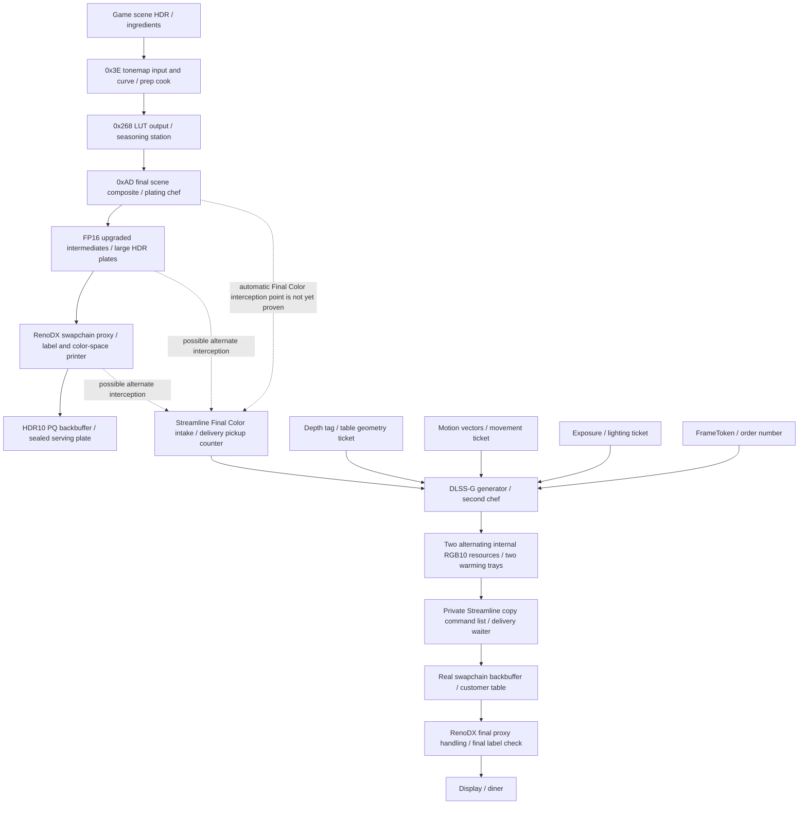

# Dying Light 2 HDR/DLSS Debug Notes

## 2026-08-01 Off Capture

Source: `ReShade.log` from the live game directory.

### 0x3E input/curve

- `format=26`, `view=26`, `1920x1080`, no clone.
- Curve constants were stable across four draws: `2.27, 0.17, 1.69, 0.8, 0.14`.
- This does not indicate a source format or curve mismatch.

### Targeted color path

- `0x3E` source is native format 26 and is routed to the same native resource (`26 => 26`).
- `0x3E` entries reported `replacement_bound=0`.
- `0x268` and `0xAD` use FP16 clone-backed outputs (`27/29 => 10`) and their replacement paths are active.
- Therefore the remaining DLSS Off color difference is not explained by the 0x3E curve or by the FP16 clone format alone; the 0x3E replacement binding state must remain a separate suspect.

### Settings-save green flash

The settings exit path triggered repeated swapchain recreation:

- multiple `ResizeBuffers` calls at 1920x1080;
- swapchain generations advanced from 2 through 6;
- `DL2 DLSS FG: resize wait result=no_fence`;
- repeated `DL2 targeted t0 clone bind skipped: replacement table allocation failed`.

This is consistent with a transient clone/descriptor-table gap during resize, and is independent of the steady-state DLSS Off source path.

## Next diagnostic boundary

Do not change DLSS Balanced or the HDR clone format. First determine whether the Off color mismatch is caused by the unbound `0x3E` replacement or by the native source content. Separately, make resize-time descriptor allocation resilient before treating the green flash as a color issue.

## 2026-08-01 Follow-up

### Replacement audit limitation

The post-bind state mirror continued to report the native pipeline for `0x3E`, `0x268`, and `0xAD` even though their replacement pipelines existed and replacement debug modes visibly executed. Direct pipeline binding is not reflected back into this state mirror, so `replacement_bound=0` is not evidence that the replacement shader failed to run.

### Legacy sRGB A/B result

With DLSS SR Off, `0x3E Legacy sRGB Output (A/B)` made the image visibly washed out rather than matching the correct DLSS Balanced appearance. Restoring the old `RenderIntermediatePass` at `0x3E` is therefore rejected as a direct fix. The Off mismatch is not a simple missing legacy sRGB encode.

### Runtime DLSS mode switch crash

Changing DLSS mode while already in gameplay caused an immediate crash. Treat runtime DLSS mode switching as unsafe until resource lifetime handling is fixed. This likely shares the settings-save resize boundary: the upscaler output resource changes while FP16 clone views and replacement descriptor tables still refer to the previous generation.

### 2026-08-18: resize cleanup fence bug

The post-restart log reproduced the crash boundary without any AD clone/output rewrite:
every `ResizeBuffers` reached `DL2 DLSS FG: resize wait result=no_fence`, followed by the
normal swapchain destroy/create sequence. `OnDestroySwapchain` previously destroyed all
DL2 FG bridge passes for every result except `timeout` and `set_event_failed`, so
`no_fence` incorrectly entered destruction. A missing Streamline fence is an unknown
GPU-lifetime state, not an idle guarantee. Resize cleanup now destroys bridge resources
only for `already_complete` or `wait_completed`; `no_fence`, timeout, and event failure
are deferred until a safe device teardown. This is a lifetime-only fix and does not
change tone mapping, resource-upgrade masks, AD behavior, or swapchain format.

## 2026-08-02 Resource Upgrade Isolation

The startup resource matrix established the following boundary:

- Native formats and `UNORM + sRGB only` preserve the expected DLSS Off color, but cap the sky near 203 nit.
- Enabling the full-size `R8G8B8A8_TYPELESS => R16G16B16A16_FLOAT` clone restores HDR headroom above 203 nit, but corrupts the DLSS Off color path.
- The UNORM and sRGB clone families are therefore neither the source of the color error nor sufficient to restore HDR headroom.

The next build narrows the typeless rule by creation index. `Typeless Resource Candidate` is a global startup setting with candidates 0 through 7; every candidate retains the UNORM and sRGB rules. A full game exit and restart is required after each change. The target result is native-format color with HDR headroom above 203 nit.

### Single-candidate result

Candidates 2, 3, 4, and 6 retain the expected color but remain capped near 203 nit. Candidate 5 changes the color darker and candidate 7 makes the image brighter, but both remain capped. This rules out a single required Typeless resource. The next matrix tests combinations `2+3`, `2+4`, `3+4`, `2+3+4`, `2+4+6`, and `2+3+4+6`, with UNORM+sRGB upgrades retained.

All tested combinations also remained capped without changing color. The indexed rules only cover one creation instance per selected index, whereas the broad rule continues matching later resources. The matrix is extended with ranges 8-63 and cumulative ranges 0-63. The `All typeless` mode is restored to the actual unbounded rule rather than a 0-7 mask.

The `8-15` range alone remained color-correct but capped at 203, while cumulative `0-15` exceeded 203 with incorrect color. This indicates an interaction between resources in `0-7` and `8-15`; `Cumulative 0-7` is added as the next boundary test.

The targeted color-path audit now reports `upgrade_index` for each captured input and output. This is derived from the actual `ResourceUpgradeInfo` attached to the resource clone, so it can identify which indexed rules are used by 0x3E, 0x268, and 0xAD without changing rendering behavior.

The first indexed capture identified the concrete late-color chain: 0x3E writes candidate 4, 0x268 reads 4 and writes candidate 5, and 0xAD reads candidate 7 after the intervening UI/composite writers. Pairwise tests and the exact `4+5+7` combination replace further broad range searching.

Runtime validation confirmed that the complete `4+5+7` set restores both correct color and HDR headroom. The pairwise subsets are incomplete: `4+5` renders too dark and `4+7` renders too light. Mode 0 is therefore changed to the production default exact chain, while the former unbounded Typeless rule remains available only as the final diagnostic option.

DLSS Balanced invalidated the fixed indices: all three captured late-color resources reported `clone=0` and `upgrade_index=-1`, leaving the path capped at 203 nit. FG then overexposed the final FP16 proxy independently. A DL2-local creation tracker now resets on swapchain initialization and assigns `creation_index` to every matching full-size Typeless render target, allowing unmatched Balanced and FG resources to be mapped without modifying the global resource-upgrade framework.

The tracker mapped Balanced without FG to candidates `0 -> 1`, and Balanced with FG to `2 -> 3`, while Off uses `4 -> 5 -> 7`. A fixed union would reintroduce unrelated upgrades. The next experiment creates inactive clones for all matching Typeless resources and calls the existing framework `ActivateCloneHotSwap` only from the known 0x3E, 0x268, UI-writer, BFFC, and 0xAD shader callbacks. This selects resources by rendering role rather than creation order.

The first semantic capture reported `clone=1` but retained resource/view formats `27=>27` and `29=>29`, so no FP16 view was actually bound. Existing working hot-swap games use a `R16G16B16A16_TYPELESS` clone resource for Typeless sources, allowing lazy view creation to map onto FP16. The semantic mode is updated to follow that established configuration; fixed-index modes retain their proven FLOAT clone.

The Typeless destination alone did not change the effective view. `ActivateCloneHotSwap` marked the resource enabled, but DL2's manual target rewrite continued to pass the original RTV. The callback now explicitly obtains the framework-managed lazy clone with `GetResourceViewClone` and rewrites the render target using that view; descriptor flushing remains responsible for the matching SRV views.

The explicit lazy-view rewrite caused a black screen and is rejected. Stable fixed-index mode `4+5+7` remains valid for Off. The captured Balanced mappings are exposed as separate startup modes `0+1` (FG Off) and `2+3` (FG On), avoiding runtime resource mutation. FG's PQ/linear overexposure remains a separate follow-up.

FG submission diagnostics now include the resource format and clone state for both `backbuffer` and `copy_source`. This distinguishes a linear FP16 source copied into an RGB10/PQ target from a correctly encoded PQ source without adding another mutation experiment.

Submission diagnostics now also print `final_color_mode` and `proxy_action`, so Direct versus Round-trip can be verified from the log rather than inferred from the UI setting.

## 2026-08-04 Stable Chains and FG Semantic Boundary

### Confirmed startup resource chains

- DLSS Off: exact candidates `4+5+7` preserve the expected color and restore HDR headroom above 203 nit.
- DLSS Balanced, FG Off: exact candidates `0+1` are the matching resource chain.
- DLSS Balanced with FG: exact candidates `2+3` upgrade the real-frame chain, but generated frames remain too dark/over-saturated and can report highlights above 10000 nit.
- These mappings are mode-specific. Do not combine them into a broad union and do not switch DLSS modes at runtime while diagnosing resource lifetime behavior.

### Rejected semantic hot-swap

The semantic hot-swap path first activated a clone without changing the effective resource/view formats. Explicitly rewriting the RTV to the lazy clone then produced a black screen. This path is rejected because the DL2 D3D12 descriptor, view, and barrier handoff is not synchronized as one atomic operation. Keep the proven fixed-index startup chains and do not use mode 31.

### FG submission result

The FG Direct and Round-trip paths are confirmed to execute. Submission logs also confirm that Compatibility changes `proxy_action` from `skip_generated_proxy` to `force_proxy_source`. Neither branch corrected the generated-frame appearance, so the remaining failure is not explained by a branch that failed to run, nor by the backbuffer/copy-source storage format alone.

### Current diagnostic hypothesis

The next boundary is Streamline color-tag metadata and transfer semantics. Earlier handoff logging observed two color tags with an unknown/zero native format. This is suspicious but not yet proof of the root cause: a pre-PQ linear resource, an already PQ-encoded final color, or a RenoDX proxy result may be registered without enough metadata for DLSS-G to interpret it consistently. The next diagnostic must enumerate every tag type, native resource and `nativeFormat`, dimensions, tracked clone, and which tags are counted as color inputs. Do not change the Off/Balanced tone mapping, PQ encoding, or fixed resource chains until that capture identifies the actual FG color input.

## 2026-08-05 Off/Balanced HDR Regression Checkpoint

### Step 1: startup configuration audit

The live `ReShade.ini` was inspected before making any rendering-code change. The global startup-only setting is currently:

```ini
[renodx]
ResourceUpgradeTest=33
```

`ResourceUpgradeTest` is read from the global `renodx` section when the addon initializes. A same-named value under a preset section is not used for resource creation. The code maps the active value as follows:

- `0`: exact DLSS Off chain `4+5+7`.
- `32`: exact DLSS Balanced, FG Off chain `0+1`.
- `33`: exact DLSS Balanced + FG chain `2+3`.

This means the last run used the FG-specific resource chain while testing DLSS Off and/or Balanced with FG disabled. That mismatch is sufficient to explain a return to native-format behavior and the approximately 203-nit ceiling; it is not yet evidence of a shader or tone-mapping regression.

### Step 2: controlled baseline procedure

Do not change DLSS mode while the game is running. For each test, select the resource-chain mode, exit the game completely, start it again, and confirm the startup log line `DL2 typeless candidate test` reports the expected mode and mask.

1. DLSS Off: select `Exact HDR chain 4 + 5 + 7` (mode `0`), restart, then measure a known bright scene.
2. DLSS Balanced with FG disabled: select `Exact Balanced chain 0 + 1` (mode `32`), restart, then measure the same scene.

Expected result for each matching chain is correct mode-specific color and highlights above 203 nit. A confirmed result will be recorded as the stable Off/Balanced HDR-chain repair summary before returning to the separate FG generated-frame issue.

### Step 3: controlled baseline result (confirmed)

Both restart-only tests passed with their matching chains. DLSS Off works with mode `0` (`4+5+7`), and DLSS Balanced with FG disabled works with mode `32` (`0+1`). Their color and HDR headroom are correct in the user-verified test scene.

**Repair summary:** the observed Off/Balanced 203-nit regression was a startup configuration mismatch, not a new shader, tone-mapping, or proxy regression. Mode `33` must be reserved for Balanced with FG. Select the chain that matches the intended DLSS/FG state before starting the game; do not change the rendering mode in a live session.

## 2026-08-05 Resource-Chain Hot-Switch Feasibility

### Step 4: lifetime and mutation audit

The exact-chain choice is consumed during addon initialization to build `resource_upgrade_infos`. The resource utility then applies a matching creation-index rule when the game creates each full-size `R8G8B8A8_TYPELESS` render target, creates an FP16 clone, and creates tracked resource views. Changing the UI setting later changes only its saved value; it does not retroactively create clones or rewrite the game, ReShade, and Streamline descriptor references for resources that already exist.

The earlier semantic hot-swap experiment is direct negative evidence: it enabled a lazy clone at a shader callback, but the game's manual render-target rewrite initially retained the original view. Rewriting the RTV to the clone explicitly then produced a black screen. DL2 therefore does not provide an atomic safe point where resource selection, all SRV/RTV descriptor tables, command-list state, and barriers can be changed together.

### Decision

Hot-switching is theoretically possible only as a full transactional renderer reset, not as a normal setting callback. A safe implementation would need to stop presentation, wait for the game queue and the DLSS-G input-completion fence, retire every affected resource/view/descriptor binding, force the game to recreate its temporal-upscaler targets, rebuild the matching clone map, and resume only after the new resources have been tagged. DL2 does not currently expose a proven callback that guarantees this boundary; changing DLSS in gameplay has already caused resource-lifetime crashes.

Keep the current restart-required chains. A future quality-of-life improvement may auto-select the correct chain at startup after detecting the initial DLSS/FG configuration, but it must still require a restart when the game's mode changes. This preserves the confirmed HDR repair instead of reintroducing the black-screen and FG synchronization failures.

## 2026-08-05 Historical Off/Balanced Result Reconciliation

### Step 5: separate color parity from HDR headroom

The historical A/B record confirms that build `787fe68` made DLSS Off and Balanced visually color-consistent. Builds `bb5a1e1` and `5ebc218` reintroduced the visible color split. However, that comparison established color parity only; it did not establish that both modes simultaneously preserved values above the approximately 203-nit boundary.

The later raw-ladder and resource-lineage work established the missing brightness condition separately. Native-format or incomplete clone paths could match color while remaining capped at 203 nit. Broad Typeless upgrades could restore headroom while corrupting color. Exact `4+5+7` was the first recorded Off chain to satisfy both conditions, after which Balanced was observed with `clone=0`/`upgrade_index=-1` on that startup mapping and required its separate `0+1` chain.

Therefore the user's memory of simultaneous Off/Balanced color parity is correct, but the current records do not support a single historical build/configuration that was verified to provide both correct color and HDR headroom for both modes without restart. Testing `787fe68` against the current fixed scene and nit measurement would be the definitive way to fill that historical evidence gap; it is not required for the current stable mode-specific repair.

### Step 6: `787fe68` versus `5ebc218` code boundary

Conversation review confirms `787fe68` was capped near 203 nit. Its code change only corrected the final proxy interpretation to Linear BT.709 (`ENCODING_NONE`), removing a second sRGB decode; it did not restore the missing FP16 intermediate range.

`5ebc218` is a credible HDR-headroom boundary. Its ancestry restored broad full-size Typeless and sRGB FP16 clone rules, changed the 0x3E bridge to emit Linear BT.709 directly, registered the 0x268 LUT replacement, and reconstructed HDR magnitude after the native SDR-domain grade. Those changes are specifically designed to carry values above 1.0 through the LUT instead of returning to the 203-nit reference-white ceiling.

The same code also explains why this was not yet the final shared solution: its Typeless rule matched every back-buffer-sized target rather than a rendering role or a mode-specific resource chain. Historical A/B already records `5ebc218` as Off/Balanced color-inconsistent. The expected old-build result is therefore both modes with HDR headroom, but a visible color difference between them. Runtime measurement of Off peak, Balanced peak, and color parity will confirm or reject that expectation before any new implementation is considered.

### Step 7: `5ebc218` runtime result

Old-build testing confirmed that `5ebc218` is normal only in DLSS Balanced; DLSS Off is not normal under the same broad resource-upgrade implementation. This rejects `5ebc218` as evidence of a previously working shared Off/Balanced solution. Its wide Typeless/sRGB clone rules happened to match the Balanced resource topology while upgrading the wrong or additional Off resources.

No `787fe68` retest is required. The conversation already records its approximately 203-nit ceiling, and its source change only corrected final proxy decoding without adding the FP16 intermediate and HDR LUT preservation introduced later. The remaining design problem is therefore resource-role identification across mode-specific creation topologies, not recovering a lost known-good universal rule.

### Step 8: Watch Dogs reference audit

The repository contains `src/games/watchdogs`, but its metadata identifies the original 2014 `Watch Dogs` (Steam app `243470`), not `Watch Dogs 2` or `Watch Dogs: Legion`. It has no DLSS or Streamline integration.

Its useful pattern is limited to DX11-style shader-scoped resource activation: it pre-creates `R16G16B16A16_TYPELESS` view clones for `B8G8R8A8_TYPELESS`, then known tone-map/AA shaders call `ActivateCloneHotSwap`, flush descriptors, and rewrite the active RTV. This is evidence that semantic activation can work when one graphics draw owns a simple immediate render-target transition.

It is not a safe template for DL2 mode switching. DL2 uses D3D12 descriptor tables, multiple typeless intermediates, compute/upscaler producers, temporal resource recreation, and Streamline references. The same semantic approach was already tested in DL2: activation without an effective view did nothing, while explicit lazy-clone RTV rewriting produced a black screen. Death Stranding Director's Cut is a closer DLSS-era reference, but it also installs static format-based upgrade rules during `init_device`; it does not dynamically change resource topology with the DLSS mode.

### Step 9: Luma Watch Dogs 2 DLSS reference audit

The Luma Framework Watch Dogs 2 implementation was shallow/sparse-cloned at upstream commit `9e5c8e7` for inspection. Unlike DL2, Watch Dogs 2 has no native DLSS integration here: Luma injects its own D3D11 NGX super-resolution pass, splits the game's deferred command list so NGX runs on the immediate context, captures the source color/motion/depth resources, and owns the resolve target and auxiliary resources.

This implementation can change DLSS quality without restarting because its color topology is invariant. The source is explicitly viewed as `R16G16B16A16_FLOAT`, the game pipeline is documented as linear, and only the NGX feature instance changes. `DLSS::UpdateSettings` compares resolution/settings, releases the old NGX feature and parameters, then creates a replacement feature before drawing. Per-frame source references are released after the injected pass, while owned resources are recreated when dimensions change.

This is useful evidence for the correct form of a safe runtime transition: the upscaler owner must control the feature lifetime, input/output resources, command execution boundary, and history reset together. It does not provide a directly portable fix for DL2, where the game and Streamline own those objects and changing DLSS also changes which native full-size Typeless resources are created. Luma therefore supports the earlier conclusion that a reliable DL2 hot switch requires a coordinated renderer/upscaler reset, not merely changing RenoDX's clone mask.

## 2026-08-05 Next Priority: FG Final-Color Handoff

### Step 10: freeze stable SR chains and isolate FG

Off mode `0` (`4+5+7`) and Balanced/FG-Off mode `32` (`0+1`) are closed, stable baselines. Further FG work must use only Balanced + FG + mode `33` (`2+3`) after a full restart and must not modify the 0x3E/0x268 tone-map math or these two stable resource masks.

The current safe code no longer renders or flushes from the native D3D12 `ExecuteCommandLists` hook; that experiment caused device removal and was reverted to a read-only timing marker. Present owns all proxy rendering again. The unresolved boundary is `preserved_native_copy`: Direct PQ currently skips the proxy for every matched copy, while PQ Round-trip forces the copy source through the proxy. Both branches were confirmed to execute, but neither corrected the generated-frame color.

The next build should therefore be diagnostic-only and classify each preserved copy against the exact Streamline Present cadence/tag serial as rendered or generated, while logging the chosen proxy action and source encoding. No color transform should change in that build. Once one class is proven to receive the wrong interpretation, apply the encode/decode fix only to that class and leave the stable non-FG path untouched.

### Step 11: read-only FG frame classification probe

The first classifier design used the interposer `Present1` hook as its frame boundary. That is not a reliable cadence boundary because Streamline can turn one game Present into multiple display Presents internally. The probe now samples the actual ReShade Present callback and correlates each event with three pieces of evidence gathered without changing rendering:

- a newly observed DLSS-G color-tag serial;
- a newly submitted command list containing the exact final `0xAD085E81` draw;
- preserved native final-color copies submitted since the preceding sampled Present, including source/backbuffer handles, storage format, tag serial, and Direct/Round-trip action.

A Present with a new color tag or exact AD submission is classified as `rendered`. Further Presents under the same nonzero tag without a new AD submission are logged conservatively as `generated_candidate`; this naturally permits multiple generated candidates for future 3x/4x cadence. Events without either signal are `unknown`. Classification is deliberately evidentiary rather than authoritative because the closed DLSS-G plugin owns the final pacing decision.

The capture reserves exactly 16 Present slots under one audit lock domain, snapshots timing and pending copies coherently, and reports any pending-copy overflow instead of silently discarding it. Each capture has a generation ID so callbacks from a prior arm cannot enter the new batch. Exact AD evidence uses a separate monotonic submission serial because the older interposer timing diagnostic destructively consumes its own AD event slot. Arming clears prior state before publishing the 16-event counter. This build does not alter proxy execution, color encoding, resource upgrades, tags, or the stable mode-specific chains.

Test only after a full restart with DLSS Balanced, FG enabled, `ResourceUpgradeTest=33` (`2+3`), and `DLSS FG Final Color=Direct PQ`. Click `Capture DLSS FG Frame Classification (16)`, remain in a moving scene for several seconds, and collect every `DL2 DLSS FG frame classification:` line plus the completion line. The result will determine whether the incorrect color is attached to the real-frame handoff, generated candidates, or both before any rendering fix is attempted.

### Step 12: first classification result and settings-exit resize

Build `8bf1c7a` produced a clean 16-Present generation-4 capture. The cadence detector worked: after the initial three rendered classifications, it settled into a repeating rendered/generated-candidate pair with one new tag and one new AD submission per rendered frame. This confirms the probe can identify the observed 2x FG cadence without assuming that higher multipliers are limited to one generated frame.

This capture cannot yet diagnose the FG PQ handoff because the startup configuration was `SwapChainFormat=1`. Startup and submission logs both confirm scRGB: `DL2 swapchain format: scRGB (FP16)`, `output_hdr10=0`, and format-10 backbuffers. Every classification consequently reported `copies=0`; the `preserved_native_copy` boundary exists only for the HDR10/PQ final-color copy that this test was intended to classify.

Exiting the game's settings screen at 12:54:45 triggered `ResizeBuffers` even though no setting was intentionally changed. Immediately after the resize, the target audit reported both `0x3E36DA5B` and `0x268BAB6D` with `clone=0`, `resource_active=0`, and `view_active=0`. This directly explains the observed transition from alternating HDR/203-nit frames to a stable approximately 203-nit result: the indexed FP16 scene clones selected at device startup were destroyed and their replacements were not upgraded. The resource-upgrade utility marks indexed targets complete after their first match and does not currently reset those per-device counters on swapchain resize.

The next valid FG classification must use `Swap Chain Format = HDR10 (PQ, DLSS FG)`, mode `33`, Balanced + FG, and a full restart. Do not enter the game's graphics settings before pressing the capture button. Separately, the resize lifecycle needs a scoped fix that resets/reapplies the DL2 upgrade rules before recreated scene targets are initialized; this is now a confirmed issue rather than an FG color hypothesis.

### Step 13: valid HDR10 FG frame classification

Generation 2 was captured with HDR10, mode `33`, Balanced + 2x FG, Direct PQ, and active `0x3E`/`0x268` FP16 clones. All 16 sampled Presents had exactly one preserved native copy and `dropped=0`. After the initial capture boundary, the classifier settled into an exact 1:1 rendered/generated-candidate cadence. Every copy used RGB10 storage (`format=24`) and Direct PQ; the copy stage therefore behaves deterministically rather than alternating resource formats or accidentally invoking the RenoDX proxy.

The two classes use two rotating RGB10 source resources. For each stable tag pair, the rendered Present consumes one source and the generated candidate consumes the other. Examples are tag 35913 (`rendered source=0x224A4E57B80`, then `generated source=0x224E0047B10`) and tag 35914 (the inverse pairing). This establishes that the visibly incorrect focused output is associated with Streamline's generated-output path before the final direct copy, not with a missing final copy or an unexpected final storage format.

The remaining semantic question is upstream of these two RGB10 outputs: whether Streamline receives DL2's pre-PQ HUDLess/UI resource, its FP16 clone, or a resource whose `nativeFormat` metadata is zero/incorrect. The existing `Capture DLSS FG Streamline Tags` and `Capture DLSS FG Handoff (2 Presents)` probes can collect that evidence in the same runtime without another build. Do not add color compensation or change the stable Off/Balanced resource chains before those tag records are correlated.

### Step 14: FG color-tag handoff

The HDR10 mode-33 handoff capture submitted two color tags successfully through `slSetTagForFrame` (`result=0`). `UIColorAndAlpha` and `HUDLessColor` both referenced the same native resource. RenoDX tracks that resource as full-size `R8G8B8A8_TYPELESS` (`format=27` decimal, printed as `1B` while the stream was in hexadecimal mode), with no active FP16 clone. The submitted resource was the original handle, not a clone.

The Streamline resource wrapper reported `nativeFormat=0` and `0x0` dimensions. These fields are optional in Streamline's D3D resource contract, so zero metadata is suspicious only when correlated with incompatible DLSS-G options; it is not proof of a format mismatch by itself. In this run `DLSSFGUseTaggedClone=0`, therefore the options hook did not force HUD-less/UI formats to FP16. No `DL2 DLSS FG options` record was captured because the options hook was installed after the startup call.

Do not route a clone or rewrite tag metadata from this evidence alone. The current DLL can continue without a rebuild: arm `Capture DLSS FG Tag Transfers (1 frame)`, `Capture DLSS FG Compute Writers (3 Presents)`, and `Capture DLSS FG Tag Writers (1 frame)` together. Their combined result should identify whether the tagged resource is a game-produced pre-PQ surface, a copied intermediate, or a surface modified by the FG path before deciding the first A/B mutation.

### Step 15: retained auxiliary surface and explicit-null A/B

The three existing probes were armed together against the same tagged resource. The transfer audit reported `count=0`; the three-Present compute audit covered tag serials `39840=>39842` with `uav_updates=0`, `uav_views=0`, and `count=0`; the graphics writer audit also reported `count=0`. This means the auxiliary surface was not rewritten or copied inside the observed post-arm window before Present. It is consistent with an earlier-produced surface retained through its Streamline lifecycle, but it does not prove that the retained content satisfies either auxiliary-input contract.

The stronger contract failure remains that one resource is submitted simultaneously as `UIColorAndAlpha` and `HUDLessColor`. The DLSS-G guide defines these as complementary inputs: HUD-less is the complete scene without UI, while UI color/alpha contains only premultiplied UI pixels and reconstructs final color when blended over HUD-less. The next build therefore adds a live four-state selector: original tags, UI only, HUD-less only, and neither auxiliary input. Disabled inputs remain in the original array position and are submitted every frame as explicit null tags, which clears retained `eValidUntilPresent` resources without corrupting tag indices. The stable mode-33 resource chain, Direct PQ output, tone mapping, and Off/Balanced paths remain unchanged.

### Step 16: auxiliary tags excluded; final-color format declaration A/B

Build `de5f7f7` logged every auxiliary selector transition, including explicit-null `None`, and the user observed no visual change in any state. The tag routing did execute, so HUD-less and UI inputs are excluded as the cause of the deep color, extreme PQ luminance, and motion artifacts. The failure is attached to Streamline's automatically intercepted Final Color path.

The same run captured the previously missing DLSS-G options call: the game supplied `colorBufferFormat=0`, `hudLessBufferFormat=0`, `uiBufferFormat=0`, and zero optional dimensions. RenoDX changed only final color from `0=>24` (`R10G10B10A2_UNORM`). That override was introduced by commit `3f4c89e` from static swapchain reasoning and has not had a causal runtime comparison. Submission logs also distinguish the normal native route (`format=28` source into the upgraded format-24 destination) from the generated output (`format=24` source copied directly to format-24 destination). The generated Direct copy is deterministic, so malformed values already exist at or before Streamline's output.

The next build changes no proxy, tone-map, tag, resource-chain, or Present behavior. It adds a restart-only process-latched selector for the forwarded `colorBufferFormat`: preserve the game's optional zero, force actual HDR10 RGB10 (`24`), or force host RGBA8 (`28`) as a last negative control. Test zero first and RGB10 second. If zero and 24 are visually identical, the following diagnostic can retest Direct/PQ/Linear generated-source interpretation under the now-correct Present timing without carrying an unresolved options mutation.

### Step 17: generated-source semantic matrix

Build `0e8a4fe` confirmed `color_mode=0 color=0=>0` with `result=0`. Streamline still produced format-24 generated sources, and the user observed no change from forced RGB10. The auxiliary tags and DLSS-G final-color format declaration are therefore both excluded. The remaining boundary is how the format-24 generated source is interpreted when it bypasses or re-enters RenoDX's final proxy under the corrected Present timing.

The next build expands the existing live `DLSS FG Final Color` selector without changing the public swapchain framework. Mode zero preserves Direct PQ. Six proxy modes test PQ/BT.2020, Linear/BT.709, sRGB/BT.709, Gamma-2.2/BT.709, Linear/BT.2020, and PQ/BT.709. A framework-provided source-override flag gates the shader branch, while a DL2-local injection padding carries the selected semantic. Normal real-frame proxy draws never enter this branch. PQ inputs use absolute-nit scaling; linear and gamma-domain inputs use DL2's proven 203-nit relative unit. The selector is live, allowing the complete transfer-function and source-gamut matrix to be tested in one runtime and one build.

Build `61a5827` loaded successfully. The user found Linear/BT.709 correct or close in color, while its highlights remained limited and FG motion still appeared poor; the other semantic candidates were rejected. This is internally consistent with the diagnostic implementation: a normalized RGB10 sample cannot exceed `1.0`, and Linear/BT.709 deliberately mapped `1.0` to 203 nits. Focus loss stops the focused-FG RGB10 handoff and returns to the normal native route, explaining why brightness then appears correct.

Review corrected an earlier assumption: `preserved_native_copy` occurs on both rendered and generated Presents while focused FG is active. The semantic override therefore transforms the complete focused-FG RGB10 output, not generated candidates alone. Since mode 2 applies the same 203-nit scale to both classes and motion still appeared poor, brightness alternation is not a sufficient explanation for the interpolation artifact. Stable 1:1 cadence proves pacing regularity only; motion quality remains a separate Streamline-input/content question to revisit after output color and scale are fixed.

The next build keeps Direct and PQ/BT.2020 as controls, fixes all remaining candidates to Linear/BT.709, and varies only the absolute scale: 203, 400, 600, 800, 1000, 1200, 1600, the current Peak setting, and 4000 nits. Every live selector change automatically re-arms 16 final-copy submission logs. This single build should identify the focused-FG output scale and provide a clean motion-quality retest at normal brightness, without changing the proven Off, Balanced, or FG resource-upgrade chains.
### 2026-08-05: final proxy source-range probe

- The focused-FG color-path capture confirmed the 0x3E -> 0x268 -> 0xAD chain, but did not include the ReShade/Streamline final proxy draw.
- DevKit snapshots currently omit that final proxy draw, so a direct numeric t0/RTV readback is unavailable without runtime instrumentation.
- Added DebugMode `FG Final Proxy Source Range (4 quadrants)`. It samples final-proxy t0 before decode, gamut conversion, scaling, or PQ encoding. The quadrants show maximum-channel bands, BT.709-luminance bands, per-channel RGB bands, and the normal source image. This is diagnostic-only and leaves normal output unchanged when DebugMode is Off.
- Interpretation: blue/cyan means very low source, green/yellow means mid-range, orange/red means substantial normalized source. Compare the four quadrants while focused FG is active.
- Entering or leaving this mode also arms 32 final-copy submission logs so the visual probe can be correlated with source/backbuffer formats, clone state, Streamline tag serial, and proxy action in the same run.
- Test result: while focused Balanced+FG was active, the top-left, top-right, and lower-left range tiles were red, while the lower-right source-reference tile was white. This indicates final-proxy t0 is reaching the normalized RGB10 range limit, not arriving as a very low-range source. The 203-nit ceiling therefore cannot be fixed by only increasing downstream proxy scaling; preserving highlight headroom requires changing the handoff representation or scaling before this RGB10 bottleneck.
- DevKit review: `a1bf52e` did not introduce the residual process behavior. The MCP server still has a detached connection-worker plus blocking `Stop()`/loader-lock shutdown race in `src/utils/ipc/ipc.hpp`; this is separate from the DL2 HDR path and should be fixed in an isolated DevKit change.

### 2026-08-05: automatic Final Color correlation

- Repeated current-build capture matched the earlier auxiliary-tag result: UI and HUD-less use one original format-27 resource with zero optional metadata, no clone, and no observed post-arm transfer, compute writer, or graphics writer. The earlier explicit-null A/B already excluded these tags from the color and motion failures.
- Expanded the existing 16-Present frame-classification capture into `Capture DLSS FG Final Color Correlation (16)`. Each classified rendered/generated Present now includes the Streamline frame token; Depth, MotionVectors, Exposure, scaling and auxiliary resources with wrapper and actual descriptors; the exact consumed 0xAD target; the Present-entry backbuffer; and every correlated Streamline RGB10 copy source.
- This remains read-only. It is intended to identify frame-token/resource skew between the automatically intercepted Final Color path and motion/depth inputs without changing the stable resource chains or Present timing.
- Only frame-based `slSetTagForFrame` snapshots are accepted as complete correlations. Legacy `slSetTag` calls have no frame token and are deliberately reported as unavailable rather than presenting partial resources as a valid match.
- Present correlation binds the `CommandBuffer + FrameToken` supplied to `slSetTagForFrame` to the native command list that executes the Final Color/RGB10 copy, rather than reading a globally latest serial during recording or Present. Generated Presents without a new copy carry the last command-context-confirmed serial. A 64-slot input ring and explicit eviction/unmatched/conflicting-copy counters expose capture loss instead of silently pairing adjacent CPU frames.
- Runtime result from `45e9ec9`: all 16 Final Color copies were `unmatched_copy`, with zero evictions or dropped records. Streamline executed every RGB10 copy on one stable private native command list, while each tagged frame supplied two different, changing command buffers. Direct `CommandBuffer + FrameToken` identity therefore cannot correlate the automatic Final Color path to tagged inputs.
- The cadence still alternated consistently: every second Present had a new 0xAD submission while the intervening Present had none. The private copy source alternated between two RGB10 resources in two-Present pairs. This preserves the rendered/generated cadence evidence but does not prove motion/depth alignment.
- Brightness remains unresolved and was not modified by this diagnostic. Every focused-FG copy reached RenoDX as RGB10 (`format=24`) under the PQ output contract. Together with the prior range probe and semantic A/B, this keeps the fault boundary at the automatic Final Color handoff/representation: either Streamline captures RenoDX's frame before the intended HDR encode, or RenoDX reinterprets Streamline's RGB10 result in the wrong domain. Final-frame nit multiplication is not a valid repair.

#### Known FG chain (restaurant roles)



Known facts: the private copy command list is stable; tagged command buffers are separate and change every rendered frame; 0xAD advances every second Present; the two RGB10 resources alternate in two-Present pairs; Linear/BT.709 interpretation preserves color but caps at 203 nits; higher linear scale breaks color; PQ interpretation is too deep. Unknown: which exact representation enters `Streamline Final Color intake`, and which writer produces the two warming-tray resources.

The next capture reuses the writer audit with `target_final_fg_output=true`. Once a preserved Final Color copy identifies either RGB10 source, the audit follows subsequent draw/RTV, dispatch/UAV, copy, and resolve writes to both resources, including visible input resources and native command contexts. A zero-writer result proves that production remains internal to Streamline and is not visible through ReShade events.

### 2026-08-05: exact FG RGB10 producer and first bridge repair

- Build `89f9b8d` discovered the writers of Streamline's two alternating RGB10 Final Color resources. Every writer is a `CopyResource` on one stable private Streamline command list.
- The copy sources exactly equal the three rotating original `0xAD085E81` targets. Example mappings from the same runtime were `0x2656D4C1380 => effective FP16 0x2656D4C39C0`, `0x2656D4C3030 => 0x2656D4C6990`, and `0x2656D4C4350 => 0x2656D4C6000`; Streamline copied the original handle in every case.
- The 16-Present correlation then confirmed an exact 1:1 cadence after the capture boundary: a new 0xAD submission on every rendered Present, followed by one generated Present. The two internal RGB10 resources alternate deterministically and no records were dropped.
- Root boundary: RenoDX's HDR scene exists in the effective FP16 clone, but Streamline bypasses that clone and copies the original normalized RGB10/UNORM target into its internal trays. This explains both the 203-nit ceiling and why FG interpolation sees content different from the frame RenoDX actually presents.
- The first `AD FP16 -> PQ/RGB10 Bridge` build (`cea9a1b`) never executed: its matcher expected the recorded 0xAD original to be RGB10, while the runtime copy is `source_format=28` (RGBA8 UNORM) to `dest_format=24` (RGB10). With no `DL2 DLSS FG AD bridge` lines, mode 11 merely exposed the existing Direct-PQ path, reproducing deep color and extreme brightness. The PQ-before-FG hypothesis was therefore not tested and is discarded because focused FG was already identified as Linear/BT.709.
- The revised DL2-local FG-only bridge recognizes the RGBA8 0xAD original, samples its FP16 Linear/BT.709 clone, and divides by `Peak / 203` before writing normalized Linear/BT.709 into the non-swapchain RGB10 Streamline tray. Mode 11 then forces the final proxy, which multiplies by the same Peak before the normal BT.2020/PQ output conversion. This encode/decode pair preserves both chroma semantics and HDR magnitude without changing the stable Off/Balanced resource rules.
- Mode 11 now records bridge success by the exact RGB10 tray handle plus swapchain generation. The Peak-scaled final proxy is enabled only when that same tray reaches the backbuffer; a rejected, failed, stale, or unmatched tray keeps the native Direct-PQ copy/skip-proxy fallback. Peaks below 203 nit use the same exact encode/decode ratio rather than clamping the normalization divisor to one. The attempted pre-draw clone-barrier mirror was rejected during review because the first physical state could not be proven; the existing framework rest-state transition contract remains unchanged in this A/B.
- Runtime result from `ea4ad80`: the first successful bridge logged `source_state=2147483648` (`general`) even though the 0xAD FP16 clone had just been written as an RTV; focus then produced a black, stuck frame. The bridge now records the producer clone as `render_target` at the 0xAD draw marker and uses that state for the later FP16 read transition.
- Runtime result from `bf10d3c`: `source_state=4` corrected the metadata, but focused output still black/stuck; a fresh Direct-PQ process remains visible. The next build therefore makes the bridge callback probe-only and logs native `D3D12_COMMAND_LIST_TYPE`, with no graphics pass or copy recorded, to isolate command-list/queue ownership safely.
- D3D12 clone barriers are not mirrored by the generic resource-upgrade callback. The bridge therefore uses the effective clone's tracked creation `initial_state` as its actual state contract, transitions from that state only while sampling, and restores it immediately. Global cache locking ends before draw recording; each cached bridge has its own recording lock and generation key. Destroyed source/tray entries are retired and are released only after the existing FG resize fence succeeds.
- The bridge does not flush, wait, create a queue, modify tags, change tone-map math, or alter the stable Off/Balanced resource masks. Final tray-to-backbuffer copies remain Direct PQ and skip the normal final proxy so the bridge output cannot be encoded twice.
- Test after a full restart with Balanced + FG, HDR10, `ResourceUpgradeTest=33`, and `DLSS FG Final Color = AD FP16 -> Linear RGB10 Bridge`. Success requires repeated `DL2 DLSS FG AD bridge ... rendered=1`, normal color, HDR headroom above 203 nit, and improved FG motion. Bounded `DL2 DLSS FG AD bridge candidate` lines now state the rejected source/effective/destination formats and reason, so a matcher miss is diagnosable from one build.

### 2026-08-06: Compute-context bridge implementation

- The command-list probe established that the eligible `RGBA8 -> FP16 -> RGB10` handoff is recorded on a D3D12 `COMPUTE` list (`type=2`); `DIRECT` (`type=0`) callbacks are final copy work and must remain native.
- The previous bridge was a graphics RenderPass. Recording RTV/Draw work from the Compute callback explains the focused black/stuck result even after the clone state was corrected.
- The new build replaces that pass with a D3D12 Compute pass: FP16 clone SRV, normalized `RWTexture2D<float4>` RGB10 UAV, UAV-to-copy-source transition, then copy into the exact Streamline tray. It does not create a queue, flush, wait, or change tags.
- Startup now checks native `R10G10B10A2_UNORM` support for typed UAV view/store. Unsupported hardware safely falls back to Direct PQ and logs `supported=0`, `support1`, `support2`, and the HRESULT.
- This is a DL2-local RenoDX bridge implemented using D3D12 primitives; it is not a new DirectX feature and does not alter other games or the shared resource-upgrade rules.

### 2026-08-06: Direct-producer staging split

- Runtime proved RGB10 typed UAV support and `rendered=1`, but focused FG still hung. The failing state was `source_state=4` (`RENDER_TARGET`) on the Compute callback.
- The bridge now uses the command-action post callback for the 0xAD draw. After the original draw is replayed, the Direct command list copies the effective FP16 clone into a DL2-local FP16 staging resource and leaves that staging resource in `shader_resource` state.
- The Streamline Compute callback no longer transitions or samples the render-target clone. It samples only the prepared staging resource, writes the RGB10 UAV, and copies the result to the exact tray.
- This preserves the existing shared framework and keeps the Direct final-copy callback native. The new runtime evidence to collect is `DL2 DLSS FG compute staging: ... copied=1` followed by `AD bridge ... rendered=1` without black/stuck focus.

### 2026-08-06: Direct-produced RGB10 handoff

- The staging version removed the black/stuck state transition, but its FP16 staging resource was still written by the Direct queue and asynchronously read by Streamline Compute. The resulting black flashes and ghosting indicate an ownership/timing hazard rather than an RGB10 format failure.
- The bridge is now tightened further: the Direct 0xAD post-draw performs the FP16-to-RGB10 Compute conversion itself and leaves a completed RGB10 resource in `copy_source`. The Streamline Compute callback only copies that prepared RGB10 resource into the exact tray.
- This eliminates FP16 reads and shader dispatches from the Streamline Compute callback. The expected runtime pair is now `DL2 DLSS FG Direct prepare ... rendered=1 state=copy_source` followed by `DL2 DLSS FG AD bridge ... copied=1 prepared_state=copy_source`.

### 2026-08-06: producer/consumer fence

- Runtime showed both RGB10 trays eventually `bridge_ready=1`, yet the whole image flashed between bright and dark. This rules out a per-tray proxy fallback as the primary cause.
- The Direct-produced RGB10 resource is custom to RenoDX, so Streamline has no reason to synchronize its Compute queue against the Direct queue that filled it. A DL2-local D3D12 fence now signals after prepared Direct command lists execute and inserts a GPU-side wait before foreign Compute command lists execute.
- No CPU wait or queue flush is used. Expected evidence is `DL2 DLSS FG bridge fence: signal ...` and stable output without whole-frame flashes.

### 2026-08-06: fence scope correction

- `07b32df` exposed the ordering hazard, but its first fence implementation waited before every foreign Compute submission once a prepared Direct value existed. That can stall unrelated game/Streamline Compute work and make the game appear unresponsive.
- The corrected implementation marks only the Compute command list that records the prepared-RGB10-to-Streamline-tray copy. The native queue hook waits on the Direct fence only when that marked list is submitted, then retires the marker. Off/Balanced resource rules and the Direct final-copy path are unchanged.

### 2026-08-07: native HDR10 output contract and PQ handoff

- A fresh 16-Present Direct-PQ capture confirmed that both alternating Streamline Final Color resources are `R10G10B10A2_UNORM`, every final copy is `RGB10 -> RGB10`, `preserve_copy=1`, `output_hdr10=1`, and `proxy_action=skip_generated_proxy`. A correctly encoded Streamline result therefore must remain a native final copy; mode 11 must never re-enter the RenoDX final proxy.
- The producer audit again showed Streamline copying the three rotating original 0xAD targets into its two internal RGB10 resources. RenoDX's completed HDR scene remains in the corresponding FP16 clones, so the missing operation is before DLSS-G intake rather than after generated output.
- Mode 11 is now `AD FP16 -> PQ RGB10 Handoff`. The Direct 0xAD post-draw converts linear BT.709 FP16 units (`1.0 = 203 nit`) to linear BT.2020 and ST.2084 PQ, writes RGB10, and leaves it in `copy_source`. Streamline then copies that exact prepared resource into its native tray, and the tray-to-backbuffer copy stays native.
- Synchronization is versioned per prepared RGB10 resource. Recording a new Direct write invalidates only that resource's prior fence value; a successful Direct submission assigns the new value; only the Compute command list copying that resource waits for that value. A missing submitted value rejects the handoff and keeps the native Direct-PQ fallback instead of performing an unsynchronized copy.

### 2026-08-07: focused-FG black flash and prepared-slot lifetime

- Runtime mode 11 reached both Streamline trays with `bridge_ready=1`, `preserve_copy=1`, and native RGB10 final copies, but the focused image flashed whole black frames. Switching `DLSS FG Auxiliary Color Tags` live from Original through mode 3 logged `ui=null hudless=null` and produced no visual change. Auxiliary color tags are excluded again; no restart is required for this control.
- The producer audit showed the two Streamline RGB10 trays being filled deterministically, while three rotating 0xAD sources each reused one RenoDX prepared RGB10 resource. The producer fence proves Direct write N completes before Compute read N, but no lifetime edge prevented Direct write N+1 from overwriting that resource before Compute read N completed.
- The next implementation replaces each singleton prepared resource with a bounded, completion-tracked slot pool. A slot is reserved from Direct recording through its exact Compute command-list submission; the submitting queue signals a separate consumer-completion fence after the copy; Direct preparation reuses only slots whose completion value has passed. This is keyed by the command-list use rather than queue type because a Direct queue may legally submit a Compute list. Busy slots cause pool growth or a logged `pool_exhausted` fallback, never a Direct queue wait. Failed signals quarantine the affected slots and log the HRESULT instead of risking reuse in an unknown GPU state.
- Tray readiness is now published only after the exact Compute submission has queued its consumer signal. Bounded logs include slot, producer serial/fence, consumer signal/completed value, and tray. This remains mode-11-only and does not alter Off/Balanced resource rules, PQ math, final native copy, or auxiliary tags.
- Final review replaced the shared producer/consumer fence timelines with one producer fence and one consumer fence per prepared slot. This prevents signals from different Direct/Compute queues from satisfying another slot's value out of order. Command-list reset releases both assignment and reservation, while a handoff epoch rejects late tray publication across FG/final-color-mode or swapchain transitions.
- Destroyed/recreated 0xAD sources now retire their prepared slot vectors instead of dropping ownership. Retired RGB10 resources and their fences are released with the bridge teardown, after the normal device lifetime boundary.
- The first runtime test of `6202457` showed `bridge_ready=0` and `bridge_ready=1` alternating for the same final-color tray. The cause was clearing the previous ready record before the replacement Compute copy was submitted; the final copy briefly fell back to the native tray. The next revision keeps the last published tray until replacement publication and raises the per-source pool from 4 to 8 after observing `pool_exhausted=1` under the queue latency.
- The follow-up runtime showed `bridge_ready=1` stable after warm-up, but visual residuals remained. A targeted `consumer fence` wait on the final copy queue was tested in `d1c1799`; it hit every final submission and produced a visible jelly-like presentation delay without removing the flash. That wait is rolled back. The remaining investigation is generated-frame/input-frame correspondence, not broader GPU waiting.

## 2026-08-30 DLSS On/Off resource-path confirmation

- Build `8eb9bc7` was used for both one-shot `Capture DLSS On/Off Color Path`
  captures. The `17:45:28` capture is the user-confirmed DLSS Off baseline;
  the `18:19:13` capture is the user-confirmed DLSS On run. Both remained in
  `generation=5`, at `2560x1440`, within the bounded capture budgets.
- DLSS Off follows the un-cloned path: `0x3E36DA5B` writes an original
  format-27 target, `0x268BAB6D` reads and writes format 27, and
  `0xAD085E81` reads the format-27 resource. All captured records report
  `clone=0`.
- DLSS On follows a different resource path: `0x3E36DA5B` writes original
  format 27 through an active effective format-10 clone (`clone=1`,
  `upgrade_index=4`); `0x268BAB6D` reads that effective format-10 resource
  and writes another format-10 clone (`upgrade_index=5`); `0xAD085E81` reads
  the resulting format-10 clone (`upgrade_index=7`). Resource and view
  handles remain consistent within each Present.
- The On capture also reports `0x3E36DA5B` in the `0x268` input-writer
  history (`input_writers=[0x3E36DA5B,0x80C96448]`), while Off reports only
  `0x80C96448`. This is ordering evidence, not an independent DLSS API state
  readback, and `0x80C96448` must not be labeled as a DLSS shader from this
  record alone.
- The confirmed On/Off boundary is resource format/clone activation and
  lifetime: Off preserves the original UNORM chain, while On routes the same
  stages through FP16 clones. No HDR shader math, Peak/Game/WhiteClip,
  Proxy, BFFC activation, or FG hook was changed for this capture.
- Capture sources were `C:\Users\xiaom\Documents\renodx\ReShade-latest.log`
  (Off, `17:45:28`) and
  `E:\SteamLibrary\steamapps\common\Dying Light 2\ph\work\bin\x64\ReShade.log`
  (On, `18:19:13`). Explicit Streamline DLSS SR options were not logged in
  this run because the Streamline hook is not installed.
- Both processes also logged `DL2 typeless candidate test: mode=0 mask=0xb0`,
  so the On capture was run with the Off chain (`4+5+7`), not a mode-specific
  On chain. For the previously verified Balanced SR + FG Off topology, the
  matching restart-only setting is mode `32` (`0+1`); mode `33` (`2+3`) is
  reserved for Balanced + FG. Therefore the On result's lack of values above
  203 nit cannot yet be attributed to a correctly selected DLSS-On resource
  chain. It proves that clones were active under mode 0, but not that mode 0
  is the right chain for the user's On configuration.

## 2026-08-30 game-settings state check

- The current `C:\Users\xiaom\Documents\Dying Light 2\out\settings\video.scr`
  is plain text and declares `Upscaler(1)`. In the game's user-facing
  semantics this is the DLSS-Off/native linear path; `Upscaler(2)` is DLSS,
  `Upscaler(5)` is FSR3, and `Upscaler(6)` is XeSS. The file comment exposes
  the lower-level names (`0=none`, `1=linear`, `2=DLSS`, `3=FSR`, `4=FSR2`,
  `5=FSR3`, `6=XeSS`), so `1` must not be mistaken for an independent
  upscaler. Its `Upscaling(3)` quality value is ignored while `Upscaler` is
  not `2`.
- The same file declares `FrameGeneration(0, 0)`. The first value is the FG
  implementation selector: `0` means FG Off, `1` means DLSS FG, and `2` means
  FSR FG. The second value is only the frame-multiplier/rate slot (`x2`, `x3`,
  `x4`, and so on) and is intentionally ignored by resource-chain selection.
  `FrameGeneration(0, 0)` must be present before launch if FG is to remain
  off; changing the file after the game has initialized is not a safe runtime
  switch.
- The latest game-directory log started at `21:21:45` and independently
  reports `DL2 typeless candidate test: mode=0 mask=0xb0`, matching the
  no-DLSS/Off state. The earlier `20:59:46` run reported mode `32` but is a
  different process/configuration and cannot be used as evidence for the
  current run.
- A startup-only auto selector is therefore feasible in principle: read
  `Upscaler`, `Upscaling`, and the first `FrameGeneration` value before
  building `resource_upgrade_infos`, then choose the already-validated mode
  `0` or mode `32` only when FG is `0`. Any nonzero FG selector must fail
  closed, show the user a disable-and-restart warning, and avoid pretending
  that the non-FG chain is valid. It cannot safely hot-switch the live
  D3D12/Streamline resource topology.

## 2026-08-30 startup selection and FG guard

- The addon now reads the active `video.scr` at process attach, before the
  device resource-upgrade list is built. With `ResourceUpgradeAutoSelect=1`
  and the manual value still at `0`, the validated native/linear path selects
  mode `0`, while DLSS Balanced (`Upscaler(2)`, `Upscaling(1)`, FG off) selects
  mode `32`. Other upscalers and unverified quality values keep the manual
  mode and are not guessed.
- If the first `FrameGeneration` value is nonzero, the addon saves a one-time
  `video.scr.renodx.bak`, atomically rewrites the tuple to `FrameGeneration(0, 0)`, and
  logs that a full game restart is required. A ReShade compatibility notice
  distinguishes a successful write from a locked/failed write. No Streamline
  FG hook or normal HDR path is enabled by this guard.
